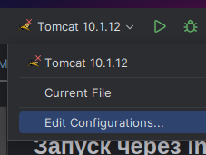
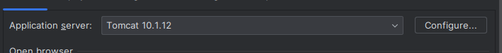
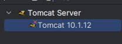
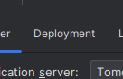
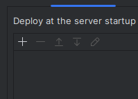
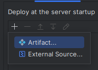
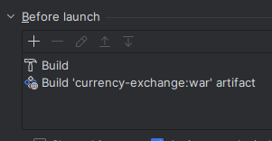

# Третье задание курса [java-backend-learning-course](https://zhukovsd.github.io/java-backend-learning-course/)

## [Задание](https://zhukovsd.github.io/java-backend-learning-course/Projects/CurrencyExchange/)

REST API для описания валют и обменных курсов. Позволяет просматривать и редактировать списки валют и обменных курсов, и
совершать расчёт конвертации произвольных сумм из одной валюты в другую.

Веб-интерфейс для проекта не подразумевается.

## Запуск через IntelliJ Idea

1. Перейти в меню конфигураций

2. Выберете свой tomcat сервер

3. Выбрать конфигурацию Tomcat 10.1.12

4. Выберете вкладку Deployment

5. Очистите все конфигурации

6. Добавьте новый артефакт currency-exchange:war

7. Во вкладке Before Launch выставьте билд, затем артифакт

## Разработка

- Сборка происходит в формат [War (WebArchive)](https://www.geeksforgeeks.org/servlet-war-file/)
- Веб сервер для запуска War файла [Tomcat 1.1.12](https://tomcat.apache.org/download-10.cgi)
- Реализация Веб апи без фреймворков
  функционала [Servlet](https://mvnrepository.com/artifact/jakarta.servlet/jakarta.servlet-api)
- Описание всех точек апи [docs](/src/main/java/com/farneser/servlets/README.md)
- Реализован простой клиент

## Примечания / требования

- ACID не было соблюдено

## Что нужно знать

- [Java](https://github.com/zhukovsd/java-backend-learning-course/Technologies/Java/) - коллекции, ООП
- [Maven/Gradle](https://github.com/zhukovsd/java-backend-learning-course/Technologies/BuildSystems/)
- [Backend](https://github.com/zhukovsd/java-backend-learning-course/Technologies/Backend/)
    - Java сервлеты
    - HTTP - GET и POST запросы, коды ответа
    - REST API, JSON
- [Базы данных](https://github.com/zhukovsd/java-backend-learning-course/Technologies/Databases/) - SQL, JDBC
- [Деплой](https://github.com/zhukovsd/java-backend-learning-course/Technologies/DevOps/#деплой) - облачный хостинг,
  командная строка Linux, Tomcat

Фреймворки не используем.

## Мотивация проекта

- REST API - правильное именование ресурсов, использование HTTP кодов ответа
- SQL - базовый синтаксис, создание таблиц
